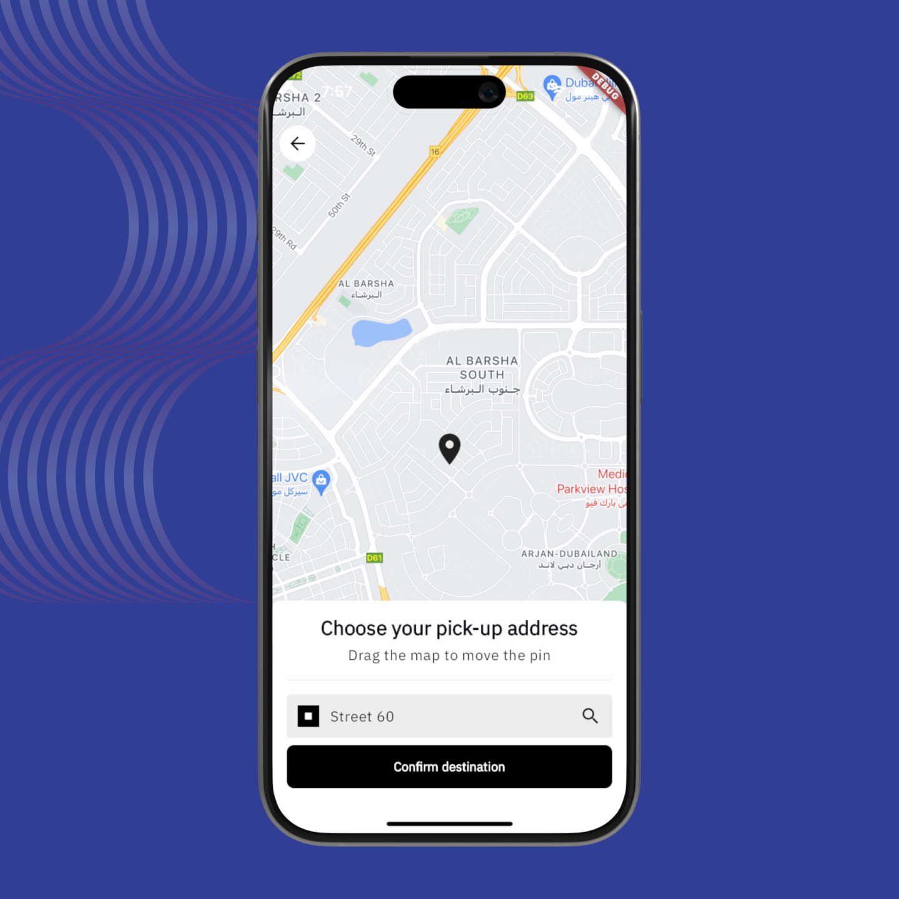
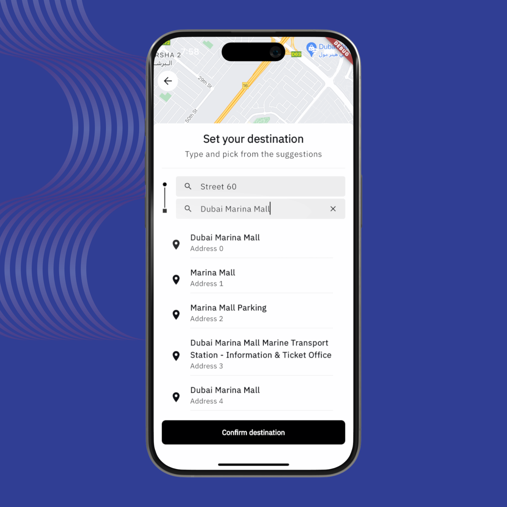
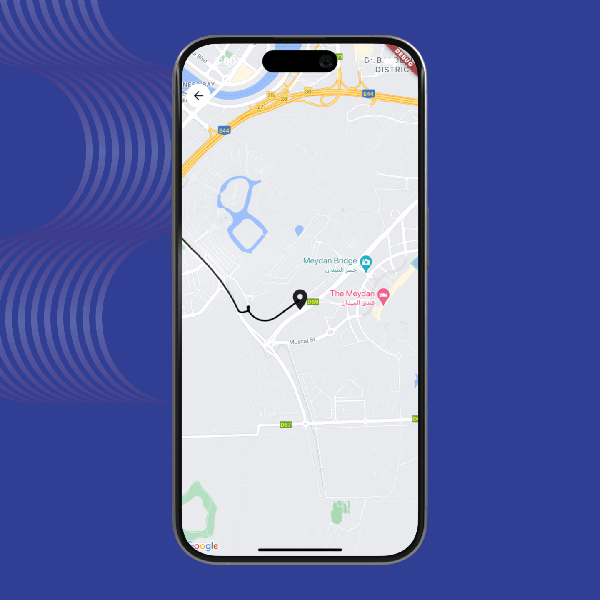

## Uber-like Maps with Flutter, Google Maps Platform and Dart Frog
This project show you how to create a map experience similar to the ride booking feature of Uber. It is a full-stack Dart project as it combines a Flutter app with a custom backend server built with Dart Frog. 

### Features:
- **Flutter UI**: A map view with google_maps_flutter where the user can choose pick-up and drop-off. 
- **Geolocator & Geocoding API**: Integration of the geolocator package to access the user location's coordinates and convert them into human-readable addresses. 
- **Places API**: Connection with the Places API to retrieve location data and as well, autocomplete suggestions. 
- **Routes API**: Interaction with 

### Video Tutorial:
Watch a video tutorial demonstrating the features and usage of this application: [YouTube Tutorial](https://youtu.be/fGV_3-XqKz8)

## App Screenshots: 
| |  |  |
|:---:|:---:|:---:|
| Select Pick-Up | Select Drop-Off | View the Route |

### How to Use:
1. Clone this repository to your local machine.
2. Ensure you have Flutter installed and set up on your development environment.
3. Run `flutter pub get` to install dependencies.
4. Navigate to the `api` directory and run `dart pub get` to install the dependencies for the backend server. 
5. Set-up your API key in the project --> How to do that in the [YouTube Tutorial](https://youtu.be/fGV_3-XqKz8) 
6. Start the backend server on your localhost with `dart_frog dev`
7. Run the app using `flutter run` and explore the maps.

### Credits:
This project is developed by maxonflutter. Feel free to contribute, provide feedback, or suggest improvements via GitHub.

For any inquiries, reach out to me. 
